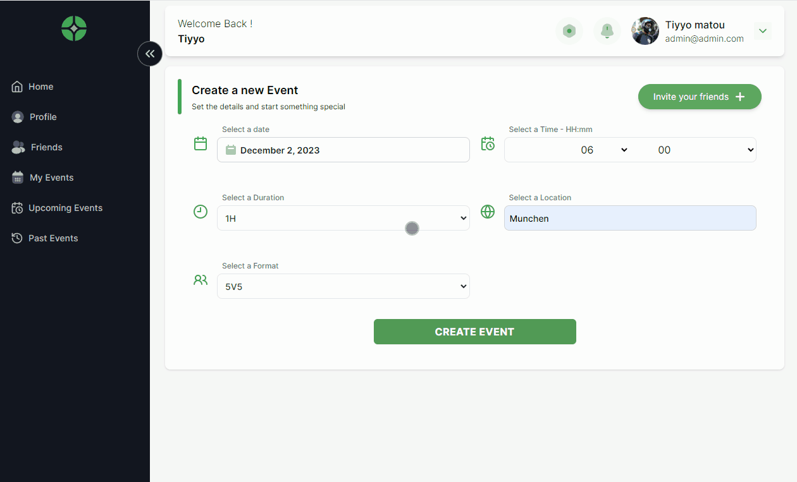

# SkillCoop Presentation

 

 

## Features

- Google OAuth2 Authentication
- User profile information management.
- Friend list management. Get suggestions of friends to add.
- Organize football matches among friends.
- Automatic team creation based on each player's skill level.
- Track personal progress through the evolution of global statistics over time.
- Maintain a record of all played matches.

### Apps and Packages

- `api`: a Node.js app
- `client`: a React.js app
- `chat-server` : a Nestjs Websocket server
- `schema`: Shared schema to validate data
- 'type' : Shared types
- 'date-handler' : Shared collection of utils functions to manage date
- `eslint-config-custom`: `eslint` configurations (includes `eslint-config-next` and `eslint-config-prettier`)

### Stack

- Express.js / Nestjs
- SQlite / Redis
- Prisma / Kysely
- RabbitMQ

- React.js
- ReactQuery / Zustand
- TailwindCSS / Shadcn/ui

- Zod
